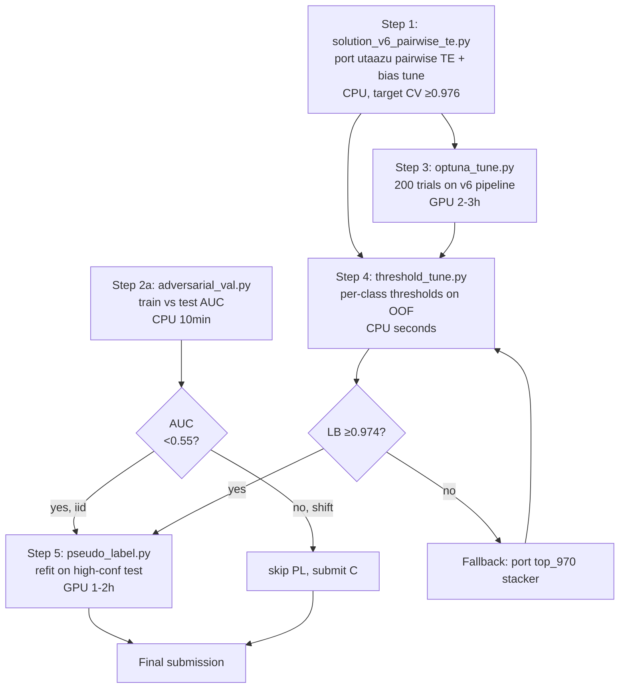

# Kaggle S6E4 "Irrigation" — GPU-Hour Push to Bronze

## Context

You're at **LB 0.968** on Kaggle Playground Series S6E4 ("Predicting Irrigation Need", metric = **Balanced Accuracy**). Public baselines hit **0.976** (Mahog XGB) and **0.979 CV** (utaazu single-LGBM with pairwise TE + bias tuning). Top-6 sit at ≥0.978. Bronze/top-20 cutoff is around **0.974+**.

You have ~13 days (Apr 30 deadline, to confirm) and GPU hours to burn. The pipeline in `C:\Users\colli\Desktop\kaggle_s6e4\` is already mature: canonical features in `solution_v3.py`, an Optuna harness, a pseudo-label harness, saved OOFs from LGB/XGB/CAT workers, two downloaded reference notebooks (`top_970`, `utaazu_979`), and `PROMPT_FOR_CODEX.md` with four pre-scoped experiments. What's missing is the one trick the leader is using: **pairwise target encoding + bias tuning**. That is almost certainly the 0.006–0.010 gap, not model capacity — your v5_anima already stacks three models while utaazu beats you with one.

Goal: **0.974+ LB in ≤10 GPU-hours**, stopping hard at 0.977 to redirect compute to DARPA MATHBAC and Kaggle AGI Metacognition.

## Dependency Shape

Steps 2b–2d (feature selection, target encoding stub, stacking meta) from `PROMPT_FOR_CODEX.md` are **shelved** — Step 1 subsumes target encoding, and stacking is the fallback (I), not a parallel track. Running them in parallel adds work that Step 1 makes obsolete.

## Step 1 — Port pairwise TE + bias tuning (CPU, highest EV)

**New file:** `solution_v6_pairwise_te.py`.
**Reuse:** `engineer_features()` from `solution_v3.py` — do not rewrite.
**Source to port:** `utaazu_979/0-979-cv-single-lgbm-pairwise-te-bias-tuning.ipynb`.

Implementation:
1. Call existing `engineer_features()` on train/test.
2. Identify categorical columns post-FE. For every unordered pair `(c_i, c_j)`, create an interaction key `c_i + "_" + c_j` and target-encode it **out-of-fold** (5-fold, same splits as CV) with smoothing α ∈ [1, 50] (Optuna will tune α in Step 3; default 10).
3. Train single LightGBM multiclass, 5-fold, early stopping on balanced accuracy.
4. Bias tuning: after predicting OOF, grid-search a per-class additive logit bias that maximizes `balanced_accuracy_score(y, argmax(proba + bias))`. Save the bias vector alongside the model.
5. Save OOF → `oof_v6.npy`, test preds → `submission_v6.csv`, model → `model_v6.pkl`.

**Gate:** 5-fold balanced-accuracy CV **≥ 0.976**. Submit to Kaggle; confirm LB within 0.003 of CV.
**If CV < 0.973:** the TE port is wrong — re-read the utaazu notebook cell by cell before continuing. Do **not** proceed to Step 3.

## Step 2 — Adversarial validation (CPU, gates Step 5)

**New file:** `adversarial_val.py` (stub already scoped in `PROMPT_FOR_CODEX.md` lines 8–22).

Concat train+test, label `is_test ∈ {0,1}`, 5-fold LightGBM classifier, record AUC + feature importances. This runs in ~10 min CPU and does **not** need GPU hours.

**Outputs:** `adv_auc.txt`, `adv_importance.csv`.
**Decisions:**
- AUC < 0.55 → distributions match, pseudo-labeling (Step 5) is safe.
- 0.55 ≤ AUC < 0.60 → drop the top-5 shift features from Step 1 pipeline and re-run Step 1.
- AUC ≥ 0.60 → **skip Step 5 entirely**; shift features are what's hurting you.

## Step 3 — Optuna on v6 pipeline (GPU-heavy, budget 2–3h)

**Edit (do not rewrite):** `optuna_tune.py` — point it at `solution_v6_pairwise_te.py`'s training function.

Settings: 200 trials, TPE sampler, 5-fold CV, objective = balanced accuracy, `device="gpu"` on LightGBM.

Search space:
- `num_leaves` 31–255
- `learning_rate` 0.01–0.1 (log)
- `min_data_in_leaf` 20–200
- `feature_fraction` 0.6–1.0
- `bagging_fraction` 0.6–1.0
- `lambda_l1`, `lambda_l2` 0–10
- `max_depth` -1 or 6–12
- **pairwise-TE smoothing α** 1–50

**Output:** `best_params_v6.json`, refit model → `model_v6_tuned.pkl`, OOF → `oof_v6_tuned.npy`, submission → `submission_v6_tuned.csv`.
**Gate:** if tuned CV does not beat Step 1 by ≥0.001, don't submit — the search space is wrong or Step 1 is already near-optimal; go straight to Step 4.

## Step 4 — Per-class threshold grid (CPU, seconds)

**New file:** `threshold_tune.py`.

On `oof_v6_tuned.npy`, grid-search per-class additive logit biases over [-0.5, 0.5] in 0.02 steps (coordinate descent is fine — one class at a time, 3 passes). Apply to test probs to produce `submission_v6_threshtuned.csv`.

**Gate:** threshold tune should add **+0.001 to +0.003** on OOF. More than +0.01 means a probability calibration bug upstream — investigate before submitting.

## Step 5 — Pseudo-labeling (GPU 1–2h, conditional)

Run **only if** adversarial AUC < 0.55 **and** Step 4 LB ≥ 0.974.

**Edit (do not rewrite):** existing `pseudo_label.py`. Use Step 3's model to predict test; keep rows with `max_proba > 0.95`; append to train with hard labels; refit with Step 3's best params for one more Optuna round (50 trials, not 200).

**Output:** `submission_v6_pl.csv`. Submit.

## Stop-conditions (hard)

- **LB ≥ 0.977:** submit, stop, reassign GPU hours.
- **5 GPU-hours spent, LB still < 0.970:** abandon pairwise-TE branch, port `top_970/s6e4-0-970-stacked-lgb-xgb-cat-feature-engine.ipynb` stacker over saved OOFs (`submission_lgb/xgb/cb`) via a simple meta-LGBM.
- **<48h to deadline, LB < 0.972:** freeze on current best, submit twice (final + safety), stop.

## Critical Files

| File | Role |
|---|---|
| `solution_v3.py` | reuse `engineer_features()`, do not rewrite |
| `utaazu_979/0-979-cv-single-lgbm-pairwise-te-bias-tuning.ipynb` | source pattern for Step 1 |
| `top_970/s6e4-0-970-stacked-lgb-xgb-cat-feature-engine.ipynb` | fallback pattern only |
| `optuna_tune.py` | extend for Step 3, don't fork |
| `pseudo_label.py` | refresh for Step 5 |
| `PROMPT_FOR_CODEX.md` | Task 1 (adversarial val) is Step 2 here; Tasks 2–4 are shelved |

## Verification

1. **Step 1 sanity:** 5-fold balanced-accuracy CV ≥ 0.976; LB within 0.003 of CV.
2. **Step 2 gate:** adversarial AUC recorded; Step 5 decision made before any GPU spend.
3. **Step 3 sanity:** tuned CV > Step 1 CV by ≥ 0.001; best params written to `best_params_v6.json`.
4. **Step 4 sanity:** OOF delta in [+0.001, +0.01]; anything outside → calibration bug.
5. **Final LB:** 0.974+ = success; 0.977+ = stop immediately.

## Decision Needed From You

One question gates Step 3: **where are the GPU hours?** Kaggle notebook (T4×2, run Optuna inside a notebook submission), Colab (same code, different auth), or local CUDA (run from your laptop against a GPU box)? The code doesn't change but the harness does. I'll ask before implementing.

Deadline (Apr 30) and priority-vs-MATHBAC/Metacognition are orthogonal to the plan shape — they only tighten the stop-conditions, which are already stated.
